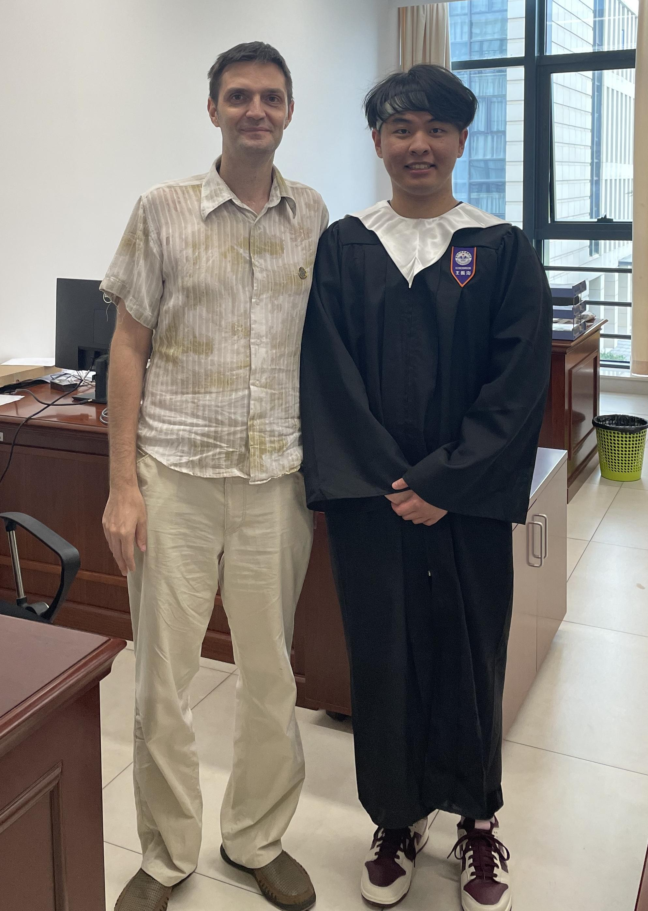

# About Me

Hello! Here is **Zhenpeng Wang (Galobel, 王振澎)**. 

I am a PhD student in the Department of Mathematics at the University of Hong Kong under the supervision of [Prof. Guangyue Han](https://hkumath.hku.hk/~ghan/), advised by [Prof. Wenan Zang](https://www.scifac.hku.hk/people/zang-wenan) and [Prof. Yunwen Lei](https://leiyw.github.io/). 

Prior to the University of Hong Kong, I have worked on Dynamic System and Algebraic Topology with [Prof. Alexey Nikitin](https://www.researchgate.net/profile/Alexey-Nikitin-3) and [Prof. Tatiana N. Fomenko](https://scholar.google.com/citations?user=Q5VuN08AAAAJ). I received the [Bachelor of Science degree](https://galobelwang.github.io/file/MSU.pdf) in mathematics from Lomonosov Moscow State University in 2024.

---
## Research Interests

- Integrable Probability and Random Walk
- Symbolic Dynamics and Cybernetics
- Quantum Information and Coding Theory

## Learning Interests

- Representation Theory and Lie Algebra
- Algebraic Geometry Codes
- Stochastic Geometry and Random Algebraic Geometry
- Combinatorics

